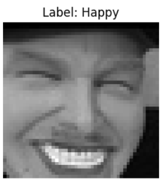
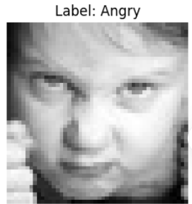

# 😊 Facial Emotion Recognition using CNN

This project implements a deep learning model for classifying facial expressions into seven emotions using the FER-2013 dataset. Built with TensorFlow and Keras, it uses Convolutional Neural Networks (CNNs) to learn from grayscale 48x48 facial images.

## 📂 Dataset

- Source: [FER-2013 Dataset on Kaggle](https://www.kaggle.com/datasets/msambare/fer2013)
- Emotions: `Angry`, `Disgust`, `Fear`, `Happy`, `Sad`, `Surprise`, `Neutral`
- Format: Images organized into folders by label
- Input Shape: 48x48 grayscale images

## 🧠 Model Architecture

The model is built using several convolutional, batch normalization, max-pooling, and dropout layers for effective feature extraction and overfitting prevention.

Conv2D → BatchNorm → Conv2D → BatchNorm → MaxPooling → Dropout
Conv2D → BatchNorm → Conv2D → BatchNorm → MaxPooling → Dropout
Conv2D → BatchNorm → Conv2D → BatchNorm → MaxPooling → Dropout
Flatten → Dense(256) → Dropout → Dense(7, Softmax)

- Optimizer: Adam
- Loss Function: Categorical Crossentropy
- Augmentation: ImageDataGenerator used for training data

## 🖼️ Output Sample

Here are some example images from the dataset used during training/testing:

| Emotion   | Sample Image |
|-----------|--------------|
| Happy 😊  |  |
| Angry 😠  |  |

## ✅ Features

* ✔️ Label distribution visualization
* ✔️ Data augmentation
* ✔️ CNN-based architecture
* ✔️ Model saving and evaluation
* ✔️ Confusion matrix visualization

